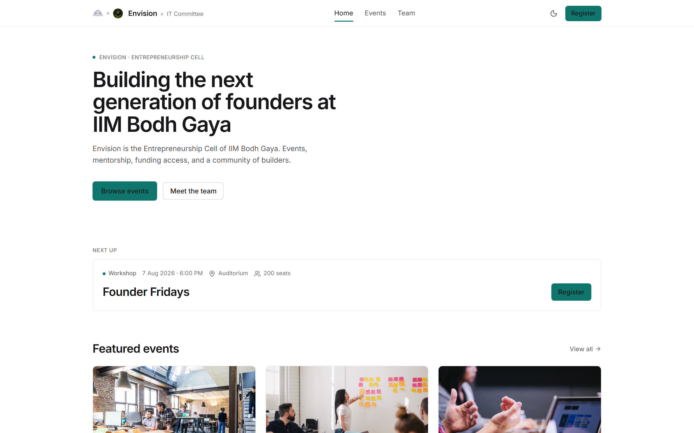
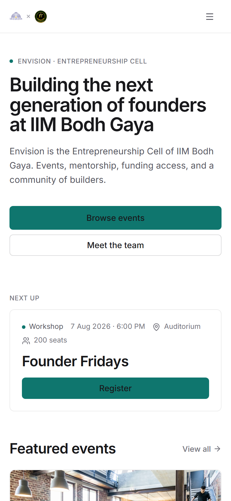

# IIM Bodh Gaya Committee Portal

The official portal for the IT Committee, IIM Bodh Gaya — browse events, meet the team, and register for sessions. Built with React 19 + Vite, Hono API on Vercel serverless, Supabase Postgres for registrations, and interactive Scalar API docs at `/api/docs`.

**Live URL:** https://your-app.vercel.app
**API docs:** https://your-app.vercel.app/api/docs

---

## Screenshots

| Desktop | Mobile |
|---------|--------|
|  |  |

---

## Features

| # | Feature | Status |
|---|---------|--------|
| 1 | **Home** — hero with SVG gold-line Buddha silhouette, featured events carousel, CTA | ✅ |
| 2 | **Events** — responsive grid (1/2/3 cols), horizontal category chips, search, empty-state link | ✅ |
| 3 | **Team** — member cards (avatar, name, role, one-line bio, vertical label) | ✅ |
| 4 | **Register** — single-column form, inline zod validation, disabled pending submit, success panel echoing event name | ✅ |
| 5 | **API + Docs** — REST endpoints with shared zod schema, Scalar at `/api/docs`, health endpoint | ✅ |

---

## Tech Stack

| Layer | Technology | Version |
|-------|------------|---------|
| Frontend | React + Vite | 19 / 8.x |
| Styling | Tailwind CSS | 4.x |
| Backend (serverless) | Hono | 4.x |
| API docs | Scalar (`@scalar/hono-api-reference`) | 0.11.x |
| Validation | zod | 4.x |
| Database | Supabase (Postgres) | 2.x |
| Deploy | Vercel (static + `/api/*` functions) | — |

---

## API

| Method | Path | Purpose |
|--------|------|---------|
| `GET` | `/api/events` | All events; supports `?category=` & `?q=` |
| `GET` | `/api/events/:id` | Single event |
| `GET` | `/api/team` | Team members |
| `POST` | `/api/registrations` | Validate (zod) → insert to Supabase → `201` |
| `GET` | `/api/health` | `{ status, uptime }` |
| `GET` | `/api/docs` | **Scalar UI** (interactive OpenAPI) |

Full interactive docs at `/api/docs` (generated from the same zod schemas via `@hono/zod-openapi` — zero drift).

---

## Setup & Run

```bash
# 1. Clone
git clone https://github.com/<your-org>/iimbg-committee-portal.git
cd iimbg-committee-portal

# 2. Install
npm i

# 3. Configure env (never commit real keys)
cp .env.example .env
# Edit .env → add SUPABASE_URL and SUPABASE_SERVICE_KEY

# 4. Dev (runs Vite + Hono API concurrently)
npm run dev

# 5. Test
npm test

# 6. Build
npm run build
```

The API runs locally at `http://localhost:8787` (via `tsx watch api/dev.ts`) and is proxied by Vite so `/api/*` calls work without CORS.

---

## Testing

| Suite | Coverage |
|-------|----------|
| `schemas.test.ts` | 8 cases — valid registration passes; bad email, short phone, unknown `event_id`, missing name all fail with correct messages |
| `events.test.ts` | Filter by category, search by partial name (case-insensitive), combined filter+search |


> Run `npm test` in CI or locally — all tests are pure logic (no browser, no DB) and complete in < 2 s.

---

## AI Usage

**Required declaration — be specific and honest:**

- **Claude Code**: scaffolded React + Vite + TypeScript + Tailwind project structure, component skeletons (`EventCard`, `FilterBar`, `Navbar`, `Footer`, `TeamCard`), Tailwind styling tokens and utility classes, Vitest boilerplate for schemas and events logic, Hono API route file with zod-openapi annotations and Scalar integration.
- **Me (the human)**: architecture decisions (Vite + Hono on Vercel, Supabase over Google Sheets), data schemas (`events.json`, `team.json`, `registrations` table DDL), validation rules (zod: name ≥2, email regex, phone 10 digits, program enum, `event_id` existence), design direction (Silicon-meets-serenity tokens, gold `#C9A227` + bodhi `#6B7F5E`, Space Grotesk / Inter / JetBrains Mono, hero SVG silhouette), code review of every file, Vercel deployment, Supabase project setup, all debugging and iteration.

> The AI Usage section is explicitly required by the submission rules. Vagueness signals copy-paste; precision signals seniority.

---

## Track 2 — Automation & Data

The feedback pipeline lives in **`apps-script/`**:

| File | Description |
|------|-------------|
| `onFormSubmit.gs` | Thank-you email on every form submission (MailApp) → `EmailLog` tab |
| `dailyDigest.gs` | Scheduled 8–9 AM Telegram digest (at-least-once) → `RunLog` tab |
| `README.md` | Deploy steps, trigger setup, Script Properties, quotas |

See `apps-script/README.md` for the full setup guide.

---

## License

MIT — built for the IT Committee recruitment 2026.